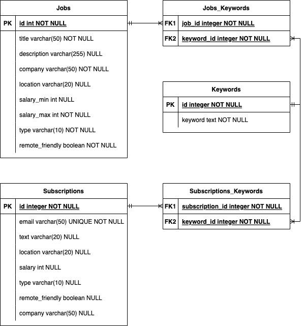

[](https://dl.circleci.com/status-badge/redirect/gh/ariel17/jobberwocky/tree/master)

# Jobberwocky home challenge

Hi there! This is my implementation for the Jobberwocky's home challenge. [Read
the requirements here](./docs/requirements.pdf).

## How to execute it

### Locally

```bash
$ go run cmd/main.go
```

### With Compose
Compose is used to build the infrastructure required for
local execution and the Avature's external source.

```bash
# console 1
$ docker-compose up  # use -d to detach console

# console 2
$ curl -v "http://localhost:8090/jobs?text=java"
```

### API Documentation
Once up and running, read the [Swagger 
documentation](http://localhost:8090/swagger/index.html) for details
on API usage.

You can update it running the following command:

```bash
$ swag init --dir cmd,internal --output api
```

### Available environment variables

```bash
# with defaults
PORT=8080
EMAIL_FROM=jobs@example.com
EMAIL_SUBJECT=A new job alert has arrived!
EMAIL_TEMPLATE=./resources/body.tmpl
NOTIFICATION_WORKERS=10
DATABASE_NAME=production.db

# required
JOBBERWOCKY_URL=http://localhost:8090
```

## Diagrams

### Architecture


### Sequence diagram


### Models diagram


